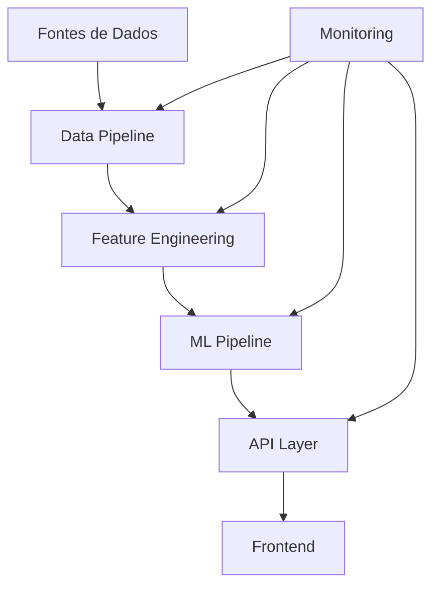
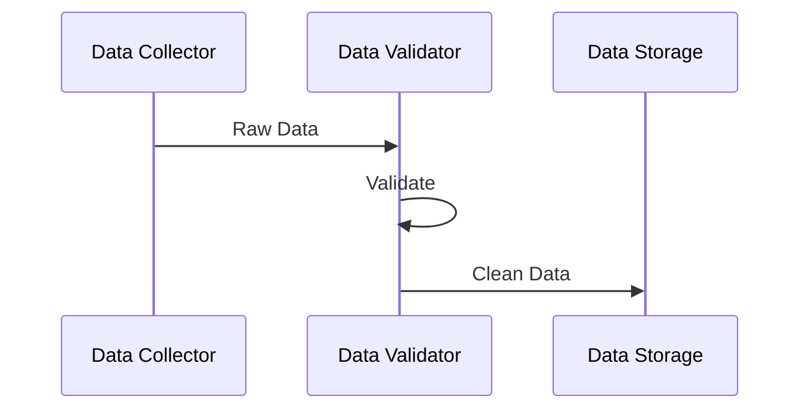
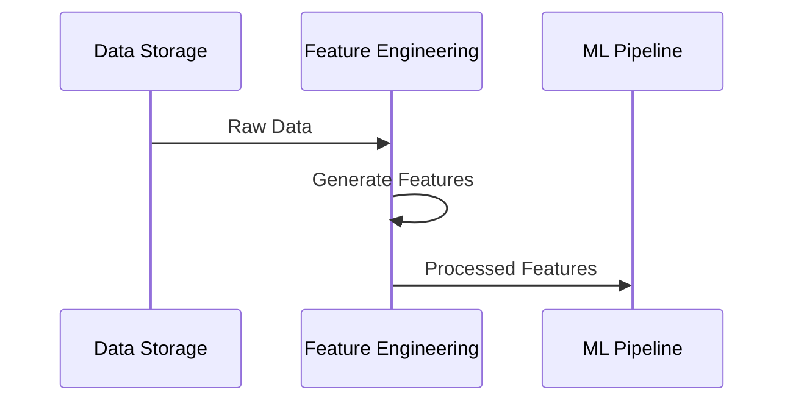
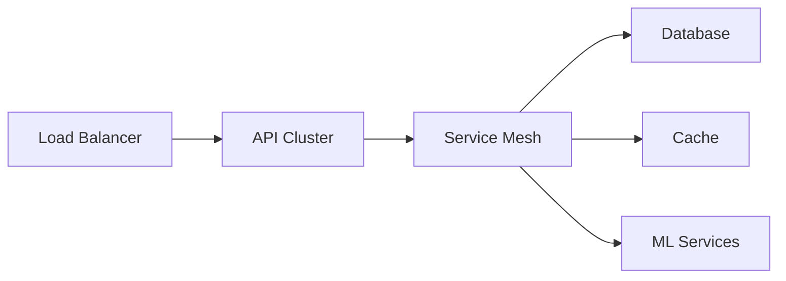
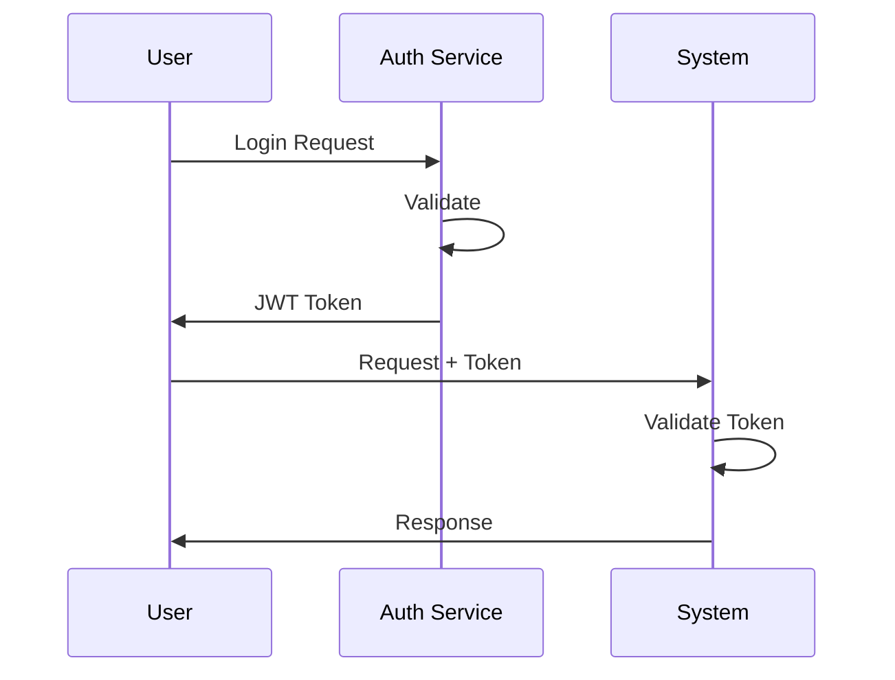
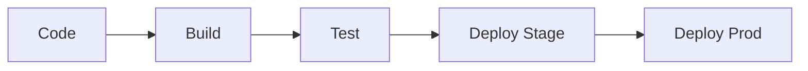

# Arquitetura do Sistema - ML Finance Platform

## 1. Visão Geral da Arquitetura



## 2. Componentes do Sistema

### 2.1 Camada de Dados
```yaml
data_layer:
  components:
    - name: "Data Collector"
      tech: "Python/Pandas"
      purpose: "Coleta de dados de múltiplas fontes"
      
    - name: "Data Storage"
      tech: "TimescaleDB"
      purpose: "Armazenamento de séries temporais"
      
    - name: "Cache Layer"
      tech: "Redis"
      purpose: "Cache de dados frequentes"
```

### 2.2 Pipeline de Processamento
```python
class DataPipeline:
    """
    Pipeline principal de processamento de dados
    """
    def __init__(self):
        self.collectors = {
            'market': MarketDataCollector(),
            'fundamental': FundamentalDataCollector(),
            'alternative': AlternativeDataCollector()
        }
        self.processors = {
            'cleaner': DataCleaner(),
            'validator': DataValidator(),
            'transformer': DataTransformer()
        }
```

### 2.3 Feature Engineering
```python
class FeatureEngineering:
    """
    Sistema de geração e gestão de features
    """
    def __init__(self):
        self.technical = TechnicalIndicators()
        self.fundamental = FundamentalFeatures()
        self.market = MarketFeatures()
        self.store = FeatureStore()
```

### 2.4 ML Pipeline
```python
class MLPipeline:
    """
    Pipeline de machine learning
    """
    def __init__(self):
        self.preprocessor = DataPreprocessor()
        self.model_manager = ModelManager()
        self.validator = ModelValidator()
        self.deployer = ModelDeployer()
```

## 3. Fluxos de Dados

### 3.1 Ingestão de Dados


### 3.2 Processamento


## 4. Infraestrutura

### 4.1 Componentes de Infraestrutura
```yaml
infrastructure:
  compute:
    - service: "API Servers"
      tech: "Kubernetes"
      scaling: "Auto-scaling"
      
    - service: "ML Training"
      tech: "GPU Clusters"
      scaling: "Manual"
      
    - service: "Data Processing"
      tech: "Apache Spark"
      scaling: "Auto-scaling"
```

### 4.2 Rede e Comunicação


## 5. Segurança

### 5.1 Arquitetura de Segurança
```yaml
security:
  layers:
    - name: "Edge Security"
      components: ["WAF", "DDoS Protection"]
      
    - name: "Application Security"
      components: ["OAuth2", "JWT", "Rate Limiting"]
      
    - name: "Data Security"
      components: ["Encryption", "Access Control"]
```

### 5.2 Fluxo de Autenticação


## 6. Monitoramento

### 6.1 Sistema de Monitoramento
```yaml
monitoring:
  components:
    - name: "Metrics Collection"
      tech: "Prometheus"
      metrics: ["System", "Business", "ML"]
      
    - name: "Logging"
      tech: "ELK Stack"
      types: ["Application", "Access", "Error"]
      
    - name: "Alerting"
      tech: "AlertManager"
      channels: ["Email", "Slack", "PagerDuty"]
```

### 6.2 Dashboards
```yaml
dashboards:
  operational:
    - "System Health"
    - "API Performance"
    - "ML Model Performance"
    
  business:
    - "Prediction Accuracy"
    - "Trading Performance"
    - "Risk Metrics"
```

## 7. Escalabilidade

### 7.1 Estratégias de Escalabilidade
```yaml
scalability:
  strategies:
    horizontal:
      - "API Layer Auto-scaling"
      - "Worker Pool Scaling"
      - "Database Read Replicas"
      
    vertical:
      - "Resource Optimization"
      - "Cache Strategies"
      - "Query Optimization"
```

### 7.2 Limites e Thresholds
```yaml
limits:
  system:
    requests_per_second: 1000
    concurrent_users: 500
    data_processing: "100GB/day"
    
  ml:
    training_time: "4h max"
    inference_latency: "100ms"
    model_size: "2GB max"
```

## 8. Disaster Recovery

### 8.1 Estratégia de Backup
```yaml
backup:
  strategies:
    - type: "Incremental"
      frequency: "Daily"
      retention: "30 days"
      
    - type: "Full"
      frequency: "Weekly"
      retention: "90 days"
```

### 8.2 Recovery Plan
```yaml
recovery:
  rto: "4 hours"
  rpo: "15 minutes"
  steps:
    - "Activate Standby Systems"
    - "Restore from Backup"
    - "Verify Data Integrity"
    - "Resume Operations"
```

## 9. Integração Contínua

### 9.1 Pipeline de CI/CD


### 9.2 Ambientes
```yaml
environments:
  development:
    purpose: "Development and Testing"
    scaling: "Minimal"
    
  staging:
    purpose: "Pre-production Testing"
    scaling: "Production-like"
    
  production:
    purpose: "Live System"
    scaling: "Full"
``` 